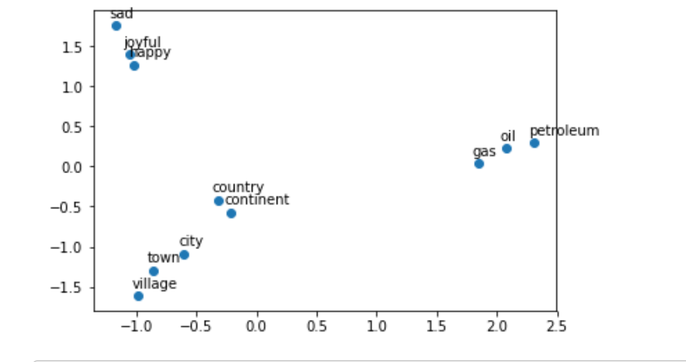

# NLP_NaturalLanguageProcessing
Goal of this project is to find simlilar documents - tweets using Vectorization

## What was developed in this project
In this project we create multiple Natural Language Processing files, focusing on the basics of Similarity between documents and word vectorization:
1. Manipulating word embedings
2. Predicting Countries from Capital using location of n dimensional space
3. Locality Sensitive Hashing
4. Find similar documents - Tweets

(note: Courses that was used as the educational material of NLP: Natural Language Processing Specialization)
